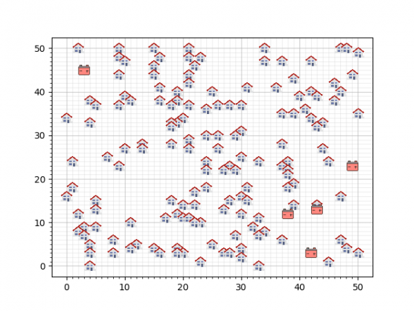

# De-Heuristische-Helden

## Getting Started

for an in-depth introduction to the case, it is recommended to read the report in the Results folder.

## The Case
At present, it is becoming increasingly popular to install solar panels on one's rooftop in order to harvest clean energy. The major downside to this trend is that this energy can only be harvested during the day, so it has to be stored if one wants to use it after the sun goes down. SmartGrid is a case in which we will be exploring possibilities for cost-efficiently storing this energy.  

The case that will be presented here can be broken down in 2 subcases:
- Case A: Connecting houses and batteries
- Case B: Placing batteries

In Case A it is the goal to connect all houses to a battery in a fixed neighbourhood, there are 3 dummy neighbourhoods containing batteries with a capacity of ~1507 and a cost of 5000 of which the following is one:



The following restraints are in place:
- Every house must be connected
- Batteries may not be (indirectly) connected with each other
- No batteries may carry a summed output higher than it's capacity

It is of importance that the summed manhattan distance between all houses and their connected batteries is minimal.

In Case B it is the goal to find a configuration of batteries and locations for the neighbourhoods in which a lower cost can be reached using the following batteries:

| Battery Type | Capacity | Cost |
|--------------|----------|------|
| PowerStar    | 450      | 900  |
| Imerse-II    | 900      | 1350 |
| Imerse-III   | 1800     | 1800 |

The following restraints are in place:
- Batteries may only be placed on uninhabited coordinates
- The same constraints as in Case A are in effect as well

the function to calculate the total cost is as follows:


- total Battery costs + 9 * summed manhattan distance of all connections

It is of importance that the summed manhattan distance between all houses and their connected batteries is, once again: _minimal_. (so the results of Case A may be vital here as well)


### Prerequisites


The codebase is entirely written in [Python3.6.3](https://www.python.org/downloads/). In requirements.txt, all the necessary packages can be found. These can be easily installed by using pip:

```
pip install -r requirements.txt
```

### Structure

- All the Algorithms can be found in the Algorithms folder
- The Classes can be found in the Classes folder
- The source data can be found in the Data folder
- The results can be found in the Results folder

### Testing

To start testing and get into the main menu, run:

```
python main.py
```
From here you will be able to navigate through a menu to run the algorithm of your choice.

## Authors

* Joeri Freesen, Tamar Vis, Angelo Groot

## Dankwoord (Acknowledgments)

- Reitze
- Daan
- Quinten
- Yannick
